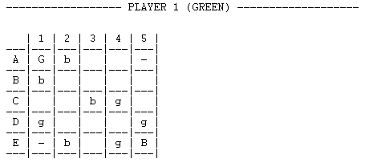

<!--
(C) 2023 José Miguel Isidro, José António Costa
Distributed under the terms of the GNU General Public License, version 3
-->

# Claustro


## License
[](https://www.gnu.org/licenses/gpl-3.0)

© 2023 José Miguel Isidro, José António Costa

All files are licensed under GNU General Public License v3, to the exception of:
- submodules, which are subject to specific licenses

Based the homonymous game by Nestor Romeral Andres and Ken Shoda, publicly available through nestorgames.  
We lay claim only over the software; this software cannot be used for commercial purposes.  
Made available under [GNU General Public License v3](LICENSE), copyrighted material used under *fair use for education*.

## Index 

- [Identification of the topic and group](#identification-of-the-topic-and-group)
- [Installation and Execution](#installation-and-execution)
  - [Installing](#installing)
  - [Executing](#executing)
- [Description of the game](#description-of-the-game)
- [Game logic](#game-logic)
  - [Internal game state representation](#internal-game-state-representation)
  - [Game state visualization](#game-state-visualization)
  - [Move Validation and Execution](#move-validation-and-execution)
  - [List of valid moves](#list-of-valid-moves)
  - [End game](#end-game)
  - [Game State Evaluation](#game-state-evaluation)
  - [Computer Plays](#computer-plays)
- [Conclusions](#conclusions)
- [Bibliography](#bibliography)


## Identification of the topic and group

- **Project name:** Claustro
- **Short description:** Board game implemented in Prolog
- **Group:** Claustro_2
- **Group members:** 
    - [José Miguel Moreira Isidro](https://github.com/zmiguel2011) (<up202006485@fe.up.pt>)
    - [José António Santos Costa](https://github.com/JaySuave) (<up202004823@fe.up.pt>)
- **Contribuition:** 
    - José Miguel Moreira Isidro: 67%
    - José António Santos Costa: 33%


## Installation and Execution

### Installation

#### Requisites

To run this game you need a running Prolog environment, preferably [SICStus Prolog 4.8](https://sicstus.sics.se/).

### Execution

1. Open SICStus Prolog 4.8;
2. Consult `game.pl`, located in the `src` folder;
3. Call the `play.` predicate without any arguments.

## Description of the game

- **Claustro** is an abstract board game with 3 simple rules (Goal, Move and Capture). The game is played in a square diamond shaped board with the opposing upper corner and lower corner being the green and blue goals, respectively, and the other two opposing left and right corners, being unoccupiable squares.

<p align="center">
  
</p>

In order to print the game properly, we decided to turn the board 45 degrees to the left, making it so the board is now a square. The upper-left corner and lower-right corner are the green (G) and blue (B) goals, respectively, and the other two opposing upper-right and lower-left corners, being unoccupiable squares (-).

<p align="center">
  
</p>

- Each player starts with the same number of pawns, and the primary objective is to reach the goal corresponding to the player color.

- Players alternatively take turns moving a pawn of their choice on square orthogonally, or capture an opponent's pawn diagonally (in all four directions). In the event of a capture, the player responsible for the capture must place the captured piece on any unoccupied square of the board.

- The game ends when a player walks a pawn into their respective goal.

## Game logic


### Internal Game state representation

To keep track of the game's internal state, we make use of a `gameState` data structure described below:

|Field|Description|
|:--:|:--|
| Board |Matrix where each element is a list, representing the squares of the board, it can contain one of 5 elements (green, blue, inaccessible, greenGoal, blueGoal)|
| Turn |1 or 2 depending on which turn is it (1-Green; 2-Blue). Its value is changed after each turn|


The `gamestate` structure is initialized like this:

```prolog
initial_state(Size, gamestate(Board, _Turn)) :-
    board_create(Size, Board1),
    replaceInBoard(Board1, 1, 1, greenGoal, Board2),       
    replaceInBoard(Board2, Size, Size, blueGoal, Board3),   
    replaceInBoard(Board3, 1, Size, inaccessible, Board4),  
    replaceInBoard(Board4, Size, 1, inaccessible, Board)
```

The first predicate `board_create/2` dinamically builds the board according to the size specified by the player. It does so calling an helper predicate `board_create/3` that is explained below:

  ```prolog
  board_create(N, I, []) :- I > N, !.
  board_create(N, I, [Row|Board]) :-
      board_create_row(N, I, Row),
      I1 is I+1,
      board_create(N, I1, Board).
  ```
  If `I` (Index) is greater than `N` (Size), we have finished creating the rows. This serves as base clause for the function.

  Furthermore, when the index is within the board size, a new element (`Row`) is prepended to the `Board`. To "populate" the rows we call an helper function `board_create_row/3` which calls `board_create_row/4` with the additional parameter `J` that refers to the column index.

  ```prolog
  board_create_row(N, _I, J, []) :- J > N, !.
  board_create_row(N, 1, J, [blue|Board]):-         
    J =< (N+1)/2,
    J1 is J+1, 
    board_create_row(N, 1, J1, Board),
    !.
  board_create_row(N, I, 1, [blue|Board]):-        
    I =< (N+1)/2,
    board_create_row(N, I, 2, Board),
    !.
  ```

  If `J` is greater than `N` , we have finished creating the current row. This serves as base clause for the function.

  After this, the second predicate refers to the first Row of the Board (`I = 1`). In here the parameter is only valid, and in result the square is populated with a `blue` piece, when the column index (`J`) is less-than or equal to half the Board size (`(N+1)/2`).

  Moreover, the third predicate refers to the first column of the Board (`J = 1`), where it replicates the effect above, this time vertically along the column.

  Similar conditions were used to populate the `green` pawns, additionally, when none of those rules apply, the squares are filled with empty values, as shown below:

  ```prolog
  board_create_row(N, I, J, [empty|Board]):-       
    J1 is J+1, 
    board_create_row(N, I, J1, Board),
    !.
  ```

At last, the predicate replaceInBoard/5 is called several times to update specific cells in the board, these being the goals and the unoccupiable (inaccessible) cells. This predicate is explained below:

```prolog
replaceInBoard([H|T], 1, Col,Value, [HNew|T]) :-
        replaceInRow(H, Col, Value, HNew).

replaceInBoard([H|T], Row, Col, Value, [H|TNew]) :-
        Row > 1,
        Row1 is Row - 1,
        replaceInBoard(T, Row1, Col, Value, TNew).
```

While the it hasn't found the desired Row, it decreases the index and keeps searching for it. When Row is equal to 1, it calls a helper predicate replaceInRow/4.

```prolog
replaceInRow([_H|T], 1, Value, [Value|T]).
replaceInRow([H|T], Index, Value, [H|TNew]) :-
        Index > 1,
        Index1 is Index - 1,
        replaceInRow(T, Index1, Value, TNew).
```

The logic here is the same as above. When it finally arrives at the right column (index), it replaces the value in the list.

Examples of different Game States representations have been hard-coded and made available to play through using the following commands on the SICStus console:

|gamestate|Command|
|:--:|:--|
| initialState | simply using the `play.` predicate ||
| intermediateState | `intermediate_state(GameState),game_loop(GameState,P1,P2,Level).` will start the game in an intermediate state | IMAGENS |
| finalState | `final_state(GameState),game_loop(GameState,P1,P2,Level).` will start the game in an final state | IMAGENS |

Note: P1 and P2 are the players, which can 'H' for human or 'C' for computer. In the latter, the user can select levels 1 or 2 in the last parameter of the game_loop/4 predicate.

#### Initial State


#### Intermediate State


#### Final State


### Game state visualization

When the game is initiated, a menu is printed. In this menu, the player can choose 6 different options:
  
  - (1-4) Different types of Gameplay;
  - (5) Instructions;
  - (0) Exit.

#### Input

  Input from the player is fetched using the `read_char/1` and `read_integer/2`:

  ```prolog
  read_char(Code) :-
      get_code(Code),
      skip_line.

  read_integer(Acc, Int) :-
      get_code(C),
      if_then_else(
          (C >= 48, C =< 57),
          (Acc1 is Acc * 10 + (C - 48), read_integer(Acc1, Int)),
          Int is Acc
      ).
  ```

  Using these functions we fetch the desired inputs directly from the stream, removing the necessity to add a dot to the end of the input, therefore improving the flow of the gameplay.
  This also reduces errors in user input as the functions will exclusively read a character or integers, respectively.

  In the `read_integer/2` predicate, we use retrieve a character from the stream using `get_code/1` and check if the character represents a digit comparing it's ASCII code with the codes of the digits 0 through 10 (`C >= 48, C =< 57`). 

  When calling this predicate, the `Acc` value is set to 0. This way, if the character is indeed a digit we update the accumulator as follows: `Acc1 is Acc * 10 + (C - 48)`, allowing us to keep retrieving characters from the stream and associating them with their respective numerical value. This had to be implemented because the board size goes up to 10.

  When a non-digit character is encoutered, the predicate returns the integer value of the characters presented by the player on the stream.

  Each menu input has a correspondant `manage_input/1` predicate that makes use of read_integer/2, then checks their validity (if input is out-of-bounds or non integer it asks for another input) and calls the predicates necessary for the actions the option describes. For example, the predicate for option 1 (`1. Human vs Human`):

  ```prolog
  manage_input(1) :-
    repeat,
    choose_board_size,
    ignore_newlines,
    read_integer(0, Size),
    validate_size(Size),   % backtrack to repeat
    !, % when input is valid, cut!, we won't backtrack to repeat anymore
    start_game('H','H', Size, _).

  ```

#### Game Display

The game has a square board that is printed before every player move, and when the player is prompted to place a captured piece. The board is represented using a `Size`x`Size` grid, which  has been previously chosen by the user (`5 <= Size <= 10`).

| Size = 5 | Size = 7 | Size = 10 |
| :---:   | :---:   | :---:   |
|  |  |  |

The predicate used to display the game is `display_game/1`, which takes a single argument `gamestate/2`:

```prolog
display_game(gamestate(Board, _Turn)) :-
  nl,
  length(Board, Size),
  Nmax is Size+1,
  printHeader(Nmax),
  printMatrix(Board, 1, Nmax).
```

After computing the lenght of the board, and therefore its size, `printHeader/1` is called which, with the help of predicates `printHeader1/2` and `printDivider/2` prints on the screen the header of the board complete with column numbers, followed by a Row divider.

The predicate `printMatrix/3` is responsible for printing the rest of the Board, taking a list `Board`, the current column number `N`, starting at 1, and the maximum column number `Nmax`. It recursively iterates of the list of Rows, printing each Row (using `printRow/1`), the subsequent divider and incrementing the column number.

There are also display predicates for the menu, such as:

  - `print_main_menu`
  - `display_choose_level`
  - `print_instructions`


### Move Validation and Execution

We decided to approach the movement in 2 separate ways. For the human players, we first let them select a pawn to move and then we print the valid moves for that pawn. On the other hand, the computer will directly choose a valid move from all possible and valid moves. Below you can see the choose_move/4 predicated.

```prolog
choose_move(GameState, 'H', _Level, Capture-move(Pawn, NewCoords)):- % (HUMAN)
    choose_pawn(GameState, Pawn),
    valid_moves_pawn(GameState, Pawn, ValidMoves),
    print_moves_pawn(ValidMoves),
    choose_move_pawn(ValidMoves, NewCoords, Capture).
```

This predicate was implemented for both human and computer players, but we'll discuss the latter in the `Computer Plays` section.

Firsly, it allows the player to choose a valid pawn to move with the helper choose_pawn/2 predicate. It thens check for the valid moves for that pawn, prints them and finally it allows the user choose from a list the move he wishes to make.

A play is only valid when we attempt to move a piece orthogonally to an `empty` cell, or capture diagonally an opponent's piece. After captures, the player is only allowed to place the captured piece in an `empty` cell.

```prolog
move(GameState, move(Pawn, NewCoords), NewGameState):-
    move_pawn(GameState, Pawn, NewCoords, NewGameState). 

move_pawn(gamestate(Board, _Turn), pawn(Row, Col), coords(NewRow, NewCol), gamestate(NewBoard, _Turn)):-
    getValueFromBoard(Board, Row, Col, Value),
    replaceInBoard(Board, Row, Col, empty, Board1),
    replaceInBoard(Board1, NewRow, NewCol, Value, NewBoard). 
```

The `move/3` predicate is responsible for moving the piece in the board, by replacing the current coordinates of the piece with an `empty` value and replacing the new coordinates with the piece value (`blue`/`green`).

This predicate is only called after the movement has been logically validated:

```prolog
valid_move_pawn(gamestate(Board,1),pawn(Row,Col),coords(NewRow,NewCol), 0):- % (Player 1)
    is_pawn_green(Board, Row, Col),
    length(Board,Max), 
    between(1,Max,NewRow),
    between(1,Max,NewCol),
    (
        getValueFromBoard(Board,NewRow,NewCol,empty),
        (
                (NewRow =:= Row + 1, NewCol =:= Col); % Right
                (NewRow =:= Row - 1, NewCol =:= Col); % Left
                (NewRow =:= Row, NewCol =:= Col + 1); % Down
                (NewRow =:= Row, NewCol =:= Col - 1)  % Up
        );
        getValueFromBoard(Board,NewRow,NewCol,greenGoal),
        (
                (NewRow =:= Row + 1, NewCol =:= Col); % Right
                (NewRow =:= Row - 1, NewCol =:= Col); % Left
                (NewRow =:= Row, NewCol =:= Col + 1); % Down
                (NewRow =:= Row, NewCol =:= Col - 1)  % Up
        )
    ).

valid_move_pawn(gamestate(Board,1),pawn(Row,Col),coords(NewRow,NewCol), 1):- % (Player 1)
    is_pawn_green(Board, Row, Col),
    length(Board,Max), 
    between(1,Max,NewRow), 
    between(1,Max,NewCol), 
    (
        getValueFromBoard(Board,NewRow,NewCol,blue), 
        (
                (NewRow =:= Row + 1, NewCol =:= Col + 1); % Down Right
                (NewRow =:= Row - 1, NewCol =:= Col + 1); % Up Right
                (NewRow =:= Row + 1, NewCol =:= Col - 1); % Down Left
                (NewRow =:= Row - 1, NewCol =:= Col - 1)  % Up Left
        )
    ).
```

The predicate `valid_move_pawn/4` above refers to the move validation for Human players, specifically the green player (Turn 1), in the case of an orthogonal non-capture move and capture move, respectively. 

In both of the cases, after checking if the coordinates being evaluated relate to the desired piece (in this case a `green` piece), a number between 1 and the lenght of the Board (`Max`) is assigned to both `NewRow` and `NewCol`, this assures the new coordinates are within bounds. 

After this, using `getValueFromBoard/4` we check the nearby cells for the values `empty`, `greenGoal` and `blue`. For each value, if any of 4 cases if true we return a valid movement.

In case a movement is considered a Capture, an correspoonding flag will be returned in the 4th argument (0=non-capture;1=capture).

We have also implemented the predicate `valid_move/4` which deals with the move validation for Computer players, but the only difference from `valid_move_pawn/4` is that instead of validating the chosen pawn, since there's no choosing taking place, it insteads retrieves a valid pawn as well. 

### List of valid moves

To retrieve the valid moves for a Human player, we use the predicate `valid_moves_pawn/3`, which uses the predefined predicate `findall/3`, to retrieve a list of valid new coordinates for the chosen pawn coupled with the flag `Capture`.

```prolog
valid_moves_pawn(GameState, Pawn, ListOfMoves):-
  findall(Capture-NewCoords, valid_move_pawn(GameState, Pawn, NewCoords, Capture), ListOfMoves). 
```

To retrieve the possible moves of a Computer player we use the similar predicate `valid_moves/3`, which instead of new coordinates (`NewCoords`) populates a list with valid movements (`move/2`) coupled with the flag `Capture`. Moreover, instead of `findall/3`, it uses `bagof/3` to remove duplicates.

```prolog
valid_moves(gamestate(Board, P), Player, ListOfMoves):-
  bagof(Capture-move(Pawn,NewCoords), valid_move(gamestate(Board, P), Pawn, NewCoords, Capture), ListOfMoves).
```

### End of game

The game only ends when a Player's piece reaches the Players goal, for example when a `green` piece reaches `greenGoal`. In order to verify this we check the corners of the board correspondant to each Player's goal for the Player's piece. We do this using the `game_over/2` predicate, which takes as an argument the `game_state` and returns the `Winner`. The predicate also prints the "Game Over" message.

```prolog
game_over(gamestate(Board, Winner), Winner):-
      checkVictory(Board, Winner), !,
      write('\n------------------ GAME OVER -------------------\n\n'),
      nl, format(' > Congratulations! Player ~w has won the game!', Winner), nl.

checkVictory(Board, 1):- is_pawn_green(Board, 1, 1).
checkVictory(Board, 2):- length(Board, Size), is_pawn_blue(Board, Size, Size).
```

### Game State Evaluation

A board where the Player is winning has positive value, a board where the Enemy Player is winning has negative value.

Using the predicates `value_green_pawn/3` and `value_blue_pawn/3` we can retrieve the associated `Value` for a `Pawn` in a determined `Gamestate`, this value refers to the orthogonal distance to the objective square, it uses `orthogonal_distance/5`. After this the `value_green/2` and `value_blue/2` predicates use `aggregate/3` to retrieve the minimum valued element from a list `MinValue` that associates each `Pawn` to their value using the first 2 predicates described above. The minimum valued element, in other words the element closer to completing the objective, determines the Player with most value on the board.

Example predicates for the `green` Player:

```prolog
value(GameState, 1, Value) :- % GREEN
    value_green(GameState, ValueGreen),
    value_blue(GameState, ValueBlue),
    if_then_else(
        ValueGreen < ValueBlue,
        Value = 1, % green player has the advantage
        Value = -1
    ), !.

value_green(GameState, MinValue) :-
    aggregate(min(Value), Pawn^value_green_pawn(GameState, Pawn, Value), MinValue).

value_green_pawn(gamestate(Board, _P), pawn(Row, Col), Value) :-
    get_green_pawn(Board, Row, Col),
    orthogonal_distance(1, 1, Row, Col, Value).
```

### Computer Plays

In our game, when the Gameplay involves Computer players, Users can select two different skill Levels for the Computer plays. The first Level is based on the predefined `random/3` predicate, so all the plays made by a Computer in this Level will be randomized. The second Level is based on a `greedy` approach, that takes into account all the available pieces and their distance to their respective goal, and returns the one that is `closest`.

The functions responsible for these move choices are in the `choose_move.pl` file and their definitions can be found below:

- Level 1
  ```prolog
  choose_random_move(GameState, ValidMoves, Move, Capture):-
    length(ValidMoves, L),
    L1 is L - 1,
    repeat,
    random(0, L, Index),
    Index >= 0, Index =< L1,
    !,
    getValueFromList(ValidMoves, Index, Capture-Move).
  ```

  The predicate `choose_random_move/4` retrieves a random `Capture-Move` tuple from the previous generated list `ValidMoves` using a randomized index (`random/3`) and the previously explained function `getValueFromList/3`.

- Level 2
  ```prolog
  best_move(GameState, ListOfMoves, Capture-Move, Value) :-
    bagof(Value-Capture-Move, (member(Capture-Move, ListOfMoves), get_move_value(GameState, Move, Value)), ListOfMovesPairs),
    min_member(Value-Capture-Move, ListOfMovesPairs).

  get_move_value(gamestate(Board, 1), Move, Value) :- 
    move(gamestate(Board, 1), Move, NewGameState),
    value_green(NewGameState, Value).

  get_move_value(gamestate(Board, 2), Move, Value) :- 
    move(gamestate(Board, 2), Move, NewGameState),
    value_blue(NewGameState, Value).
  ```
  In the code above, `best_move/4` is the central predicate responsible for selecting the better valued Computer move for "Level 2". In this predicate `bagof/3` is used to collect `Value-Capture-Move`, where `Value` is the Move value and `Capture-Move` represent the actual Move, combinations from `ListOfMoves`. Additional goals are exectued within the `bagof/3` predicate to check if the Move is a valid one (`member(Capture-Move, ListOfMoves)`) and to compute the value of each Move (`get_move_value/3`).

  The bottom two predicates serve to calculate a Value of a specific Move, using the previously explained predicates `value_green/2` and `value_blue/2` to evaluate a `gamestate` after applying the Move.


## Conclusions

Overall the development of the program was enjoyable, the deadlines were achievable and the pratical lessons were very much helpful and ilustrative in regards to the project. We, as a group, feel we accomplished the features we proposed ourselves, and believe we were able to present well documented and organized code.

We have also gained an understanding of some of the uses of the Prolog language and have tried to make the most out of its perks and quirks.

## Bibliography

- https://boardgamegeek.com/boardgame/391334/claustro

